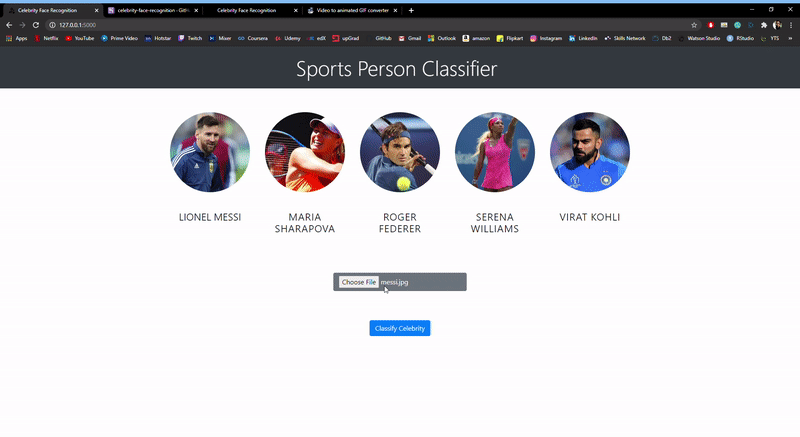

# Celebrity Face Recognition WebApp
 
In this data science and machine learning project, we classify sports personalities. We restrict classification to only 5 people. In this model firstly we collected images of the athletes from the internet and then cropped all the face detected in images using OpenCV. Then we Wavelets transformed the images to extract the key feature of the faces. Then we created a training set to train the data. We tried many algorithms but chose SVM as it was giving the best results. Then we created a flask application as a backend to handle the input and return output.

## Five Celebrities
1. Maria Sharapova
2. Serena Williams
3. Virat Kohli
4. Roger Federer
5. Lionel Messi

## Technologies used in this project
- Python
- Numpy and OpenCV for data cleaning
- Matplotlib & Seaborn for data visualization
- Sklearn for model building
- Jupyter notebook, visual studio code and pycharm as IDE
- Python flask for HTTP server
- HTML/CSS/Javascript for UI

## Deployment
This Model is deployed on Heroku Server

## License and Copyright
© Vishwas Basotra
Licensed under the [MIT License](LICENSE).
